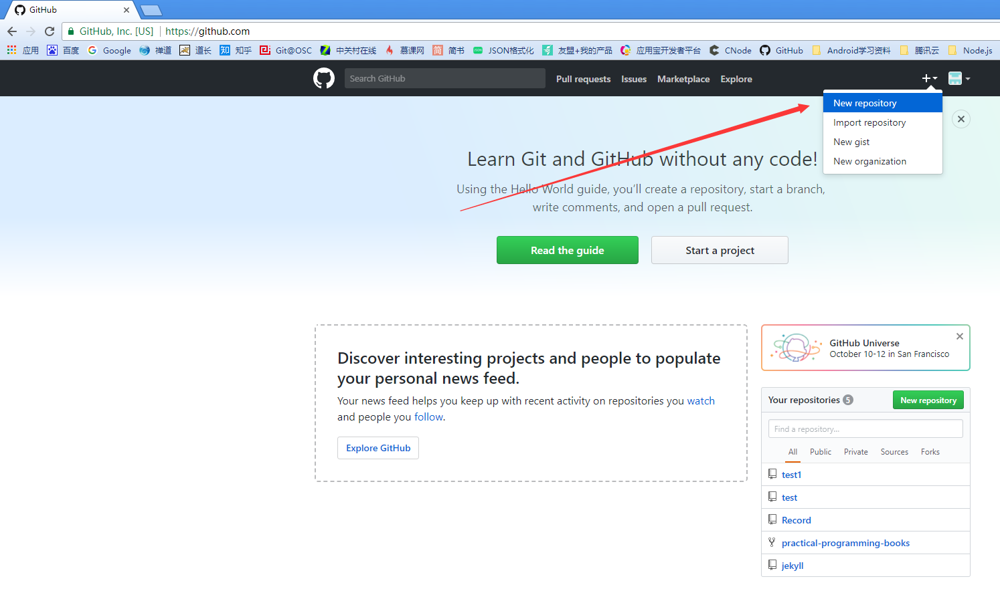

## Git代码首次提交到远程仓库
很多人接触Git后的第一步操作就是提交本地的代码到远程仓库，包括之前是使用SVN等其他版本控制工具的用户。我们这里就来详细介绍一下如何把本地的代码关联到远成仓库。

首先，要有一个远程仓库，其实按照Git的分布式原理，任何一台电脑都可以作为一个远程仓库。但在实际的使用中，往往需要这个远程仓库保持全天24小时不停地运行，不然不能保证多人协作下的实时性。但是每个项目都单独搭建这么一台仓库也是费时费力的，好在前辈们已经早已想到了这个问题，GitHub就是这样一个大型的代码仓库，全世界无数的代码都托管在上面，类似的还有GitLab、码云等。当然托管上去后，你的代码就可以被所有人查看了。可以通过付费的方式设置为私有的，这个就要量力而行了。
好了，貌似有些跑偏了，现在就先在GitHub上新建一个远程仓库：

